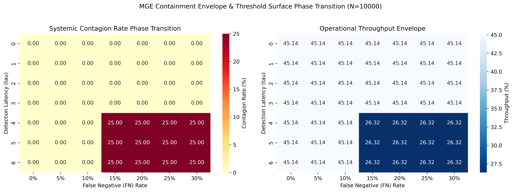

# Model-Governance Engine (MGE)

Official replication package and simulation artifacts for the manuscript: **"Technical Vulnerabilities as Sources of Deep Uncertainty: Regulating Value Missing and Value Slippage via Series LLC Architectural Infiltration"**.

> **Double-Blind Review Notice:** This repository is structured to comply strictly with double-blind peer-review protocols. All author names, institutional affiliations, and specific geographic identifiers have been systematically sanitized from the source code, documentation, and metadata.

---

## 1. Overview

This repository contains the complete discrete-event simulation model and technical architecture blueprint for the **Model-Governance Engine (MGE)**. The MGE functions as a stateless, computationally secure middleware layer interposed between autonomous agentic workflows and external digital platform ecosystems.

By compiling macro-level statutory requirements derived from the **Series LLC** framework into meso-level, executable trigger-action pairs ($C_t = 0$), the engine operationalizes organizational law at machine speed to neutralize deep uncertainty, preventing the dual failure states of *Value Missing* and *Value Slippage*.

---

## 2. Repository Structure

```text
model-governance-engine/
├── README.md                    # Documentation, setup, execution, and replication guide
├── mge_simulation.py            # Unified replication script for baseline, stress-profile, and leakage metrics
├── mge_sensitivity_heatmap.py   # High-resolution 2D parameter-sweep heatmap generator
├── mge_sensitivity_heatmap-600.png  # Sensitivity Heatmap in 600 DPI
├── Forensic_registry/           # Illustrative tamper-evident forensic JSON traces generated during execution
│   └── .gitkeep
└── LICENSE                      # Open-source artifact distribution license (MIT/Apache)
```

### File Descriptions

- **`mge_simulation.py`**  
  Generates the baseline empirical comparison, the named deterministic stress-profile matrix, and the complementary probabilistic leakage contrast metrics in a single execution workflow. All quantitative replication benchmarks across variable simulation seeds are consolidated in this script to ensure computational alignment.

- **`mge_sensitivity_heatmap.py`**  
  Generates the production-grade, high-resolution (600 DPI) dual two-dimensional parameter sweeps used for the manuscript’s sensitivity visualization. These heatmaps map the joint effects of False Negative (FN) verification rates and detection latencies. The default output image is written as `mge_sensitivity_heatmap-600.png`.

- **`Forensic_registry/`**  
  Stores the illustrative, tamper-evident forensic JSON traces generated during execution. These artifacts are included to demonstrate the runtime evidence-preservation logic and its NIST SP 800-86-oriented forensic compliance workflow.

- **`README.md`**  
  Provides repository setup instructions, required software versions, execution steps, parameter settings, and expected output guidance for replication.

---

## 3. Prerequisites & Installation

The simulation engine is implemented in **Python 3.12** and relies on standard data science libraries for performance tracking and matrix formatting.

### Dependencies

Ensure the following Python packages are installed in your execution environment:

- `numpy` (>= 1.26.0)
- `pandas` (>= 2.2.0)
- `tabulate` (>= 0.9.0)

To install all dependencies via `pip`, execute the following command:

```bash
pip install numpy pandas tabulate
```

---

## 4. Execution and Replication

### Default and Custom Iteration Counts

Both scripts accept an optional integer argument specifying the number of simulation runs.

- Running the script **without an argument** executes **500 runs** by default.
- Running the script **with an integer argument** executes the script for the specified number of runs.

### Usage Examples

Run the main simulation workflow with the default setting:

```bash
python mge_simulation.py
```

Run the main simulation workflow for a custom number of iterations:

```bash
python mge_simulation.py 1000
```

Run the sensitivity heatmap workflow with the default setting:

```bash
python mge_sensitivity_heatmap.py
```

Run the sensitivity heatmap workflow for a custom number of iterations:

```bash
python mge_sensitivity_heatmap.py 1000
```

### Main Replication Workflow

The manuscript reports the **10,000-run results** in the main text. To reproduce that configuration, run:

```bash
python mge_simulation.py 10000
```

This script generates, in a single execution pipeline:

1. the baseline empirical comparison reported in the manuscript;
2. the named deterministic stress-profile matrix used for the sensitivity comparison;
3. the complementary probabilistic leakage contrast metrics; and
4. illustrative forensic JSON trace outputs written to the `Forensic_registry/` directory.

### Computational Workflow Enforced by MGE

1. **Intervals 1 to 2,603:** Both the Monolithic Baseline and the Cellular Series LLC architecture process compliant telemetry states ($C_t = 1$).
2. **Interval 2,604 (Adversarial Payload Ingestion):** An indirect prompt injection and goal-hijacking exploit occurs stochastically within the external ecosystem network.
3. **Post-Anomaly Containment:**  
   - The **Monolithic Baseline** triggers systemic contagion, causing full operational collapse and a forced *ex post* system freeze.  
   - The **Cellular Series LLC** architecture, through the MGE layer, intercepts the anomaly at the verification boundary ($C_t = 0$), executes outward interdiction and inward halting, preserves sibling-cell integrity, and writes tamper-evident forensic traces to the `Forensic_registry/` directory.

### Sensitivity Heatmap Generation

To generate the high-resolution sensitivity heatmaps used in the manuscript, run:

```bash
python mge_sensitivity_heatmap.py 10000
```

This script produces the dual two-dimensional parameter sweeps mapping the joint effects of False Negative (FN) verification rates and detection latencies. 
The output image is saved as:

```text
mge_sensitivity_heatmap-600.png
```


### Alternative: Zero-Installation Execution via GitHub Codespaces

If you prefer not to configure a local Python environment, you can execute the scripts directly in your browser:

1. Click the **Code** button at the top right of the repository.
2. Select the **Codespaces** tab.
3. Click **Create codespace on main**.
4. Once the terminal initializes, run either:

```bash
python mge_simulation.py
python mge_sensitivity_heatmap.py
```

or specify a custom number of runs, for example:

```bash
python mge_simulation.py 10000
python mge_sensitivity_heatmap.py 10000
```

---

## 5. Expected Empirical Output

Running `mge_simulation.py` produces the manuscript’s baseline empirical comparison, the deterministic stress-profile outputs, and the associated leakage-contrast metrics. The **10,000-run configuration** reported in the manuscript can be reproduced by executing:

```bash
python mge_simulation.py 10000
```

The baseline comparative performance matrix is then emitted in LaTeX booktabs format as follows:

```text
MGE REPLICATION PROCESS COMPLETED SUCCESSFULLY (MONTE CARLO N=10000)
================================================================================
Forensic verification trace written to: ./Forensic_registry/mge_forensic_trace_protected_series_beta.json
================================================================================

--- CONSOLE REPLICATION MATRIX TABLE 3 ---
+--------------------+---------------------+-----------------+---------------+----------------------+------------------+---------------------+----------------------+
| Scenario           |   Exploit Prob. (p) |   Latency (tau) | FN Rate (%)   | Contagion Rate (%)   | Throughput (%)   | Value Missing ($)   | Value Slippage ($)   |
+====================+=====================+=================+===============+======================+==================+=====================+======================+
| Ideal Control      |               0.001 |               0 | 0%            | 0.00 +/- 0.00        | 45.14 +/- 0.00   | $11,767,500.00      | $8,500.00            |
+--------------------+---------------------+-----------------+---------------+----------------------+------------------+---------------------+----------------------+
| Standard Lag       |               0.001 |               2 | 5%            | 0.00 +/- 0.00        | 45.14 +/- 0.00   | $11,767,500.00      | $12,500.00           |
+--------------------+---------------------+-----------------+---------------+----------------------+------------------+---------------------+----------------------+
| High Volatility    |               0.01  |               1 | 10%           | 0.00 +/- 0.00        | 45.14 +/- 0.00   | $11,767,500.00      | $18,500.00           |
+--------------------+---------------------+-----------------+---------------+----------------------+------------------+---------------------+----------------------+
| Adversarial Stress |               0.01  |               5 | 20%           | 25.00 +/- 0.00       | 26.32 +/- 0.00   | $11,767,500.00      | $42,500.00           |
+--------------------+---------------------+-----------------+---------------+----------------------+------------------+---------------------+----------------------+

================================================================================

==================================================
          SIMULATION EMPIRICAL RESULTS
==================================================
Total Temporal Horizon (T) : 10000 intervals
Parallel Agent Capacity (N): 5 active units
Adversarial Incident Point : t = 2604
Monte Carlo Replication N  : 10000
--------------------------------------------------
[MONOLITHIC BASELINE PARADIGM]
  Systemic Contagion Rate  : 73.96%
  Strategic Velocity Index : 0.00% (Catastrophic System Freeze)
  Accumulated Value Missing: $12,468,750.00
  Accumulated Value Slippage: $8,500.00
--------------------------------------------------
[CELLULAR PURPOSE-BOUND CELLS (ADVERSARIAL STRESS)]
  Systemic Contagion Rate  : 25.00% (Bounded Partial Leakage)
  Strategic Velocity Index : 26.32% (Portfolio Resilience Sustained)
  Accumulated Value Missing: $11,767,500.00
  Accumulated Value Slippage: $42,500.00
==================================================
```

In addition, running `mge_sensitivity_heatmap.py` generates a high-resolution PNG figure file:


```text
mge_sensitivity_heatmap-600.png
```

---

## 6. Digital Forensics & Verification

When an anomaly is intercepted, the MGE's **Cryptographic Logging Registry** automatically dumps a forensically sound, timestamped JSON execution trace into the `./Forensic_registry/` folder. This process is designed to reflect a NIST SP 800-86-oriented evidence-preservation workflow, maintaining a tamper-evident chain of execution records for downstream forensic inspection.

---

## 7. License

This repository is distributed under the license specified in the `LICENSE` file.

---

## 8. Citation

If you use this repository for academic or research purposes, please cite the corresponding manuscript.
